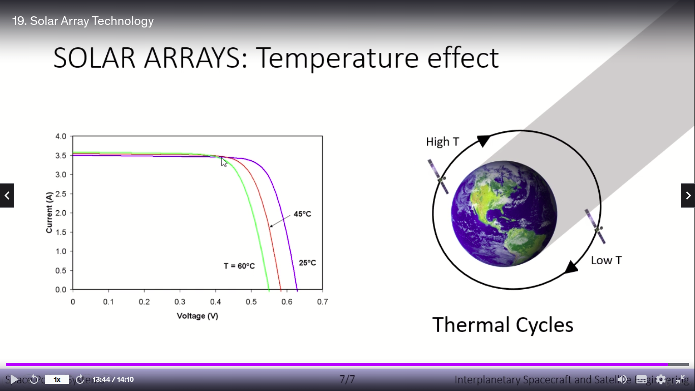
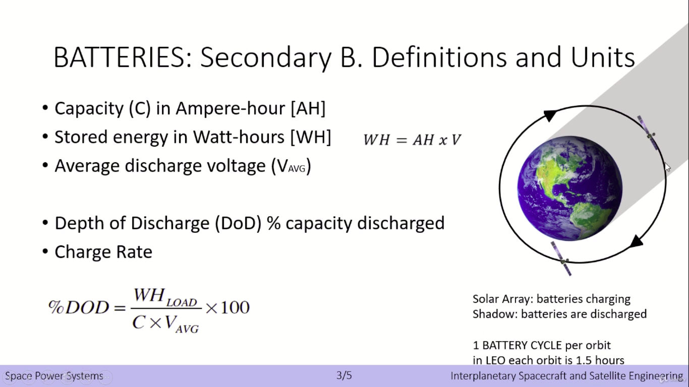
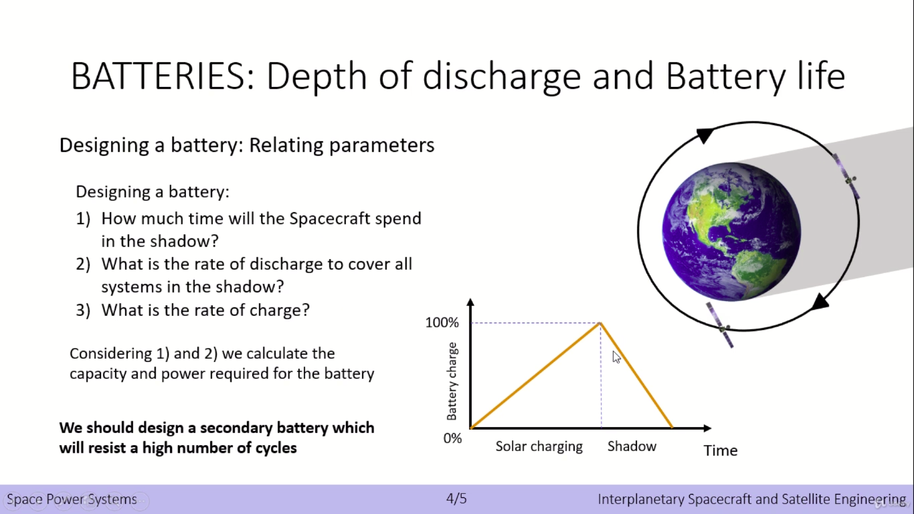
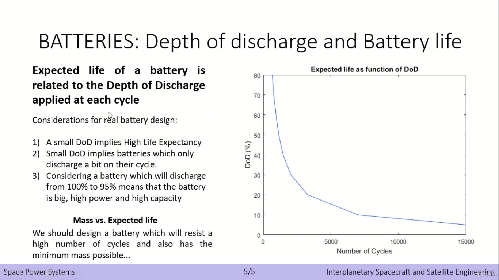

# Interplanetary Spacecraft and Satellite Engineering

## Orbital Parameters:

- Semimajor Axis
- Eccentricity
- Inclination -> dihitung dari plane of reference (bisa equator bisa ekliptik)
- Longitude of Ascending Node -> Diukur dari titik Aries sepanjang garis plane of reference
- Argument of Periapsis -> diukur dari ascending node ke periapsis sepanjang plane orbit
- True Anomaly -> diukur dari periapsis ke objek sepanjang plane orbit

## Orbit manuver gravity assist

## Space Propulsion
- Chemical Internal Heat Engines
- Electric Propulsion
- Nuclear Propulsion

## Communication

How antenna can generate information from EM waves:

Important part of satellite link:
- Up-Converter
- Encoder - Decoder
- High Power Amplifier (trasmitting ground station)
- Low Noise Amplifier (receiving ground station)
- Satellite Repeater

Power graph of satellite link:

## Attitude

Orientation of the spacecraft respect to an inertial reference of frame (central of earth maybe):
- x: roll (in the direction of $\vec{v}$)
- y: pitch
- z: yaw (radially outward of central body)

Measured counter-clockwise in each axis

**Attitude Determination**: measuring the orientation of the spacecraft

**Attitude Control**: returning the spacecraft to its desired attitude

Sistem kontrol attitude:

Attitude jitter: ada osilasi sedikit pada spacecraft, ada batas toleransinya juga

"In the absence of external torques, a body can spin stably only about the axis of maximum moment of inertia"

**Kasus**:

Punya USA itu ga stabil karena di space nanti akan ada rotasi pada axis yg momen inersianya maksimum, mereka kira cuma rotasi pada sekitar axis body yg panjang

Punya Russia stabil karena spherical aj, simpel

## Sensor untuk Attitude Control and Determination

**Gyroscope**

**Sun Sensor and Star Tracker**

**Magnetometer**

## Actuator

**Momentum Wheel**

**Control Moment Gyros**

**Thrusters**

**Magnetic Torquers**

## Power System

Solar Arrays: Solar Flux and its inverse square law

Solar Arrays: Array Configurations

Solar Arrays: Photovoltaics Theory

Triple junction solar cell: pake solar cell yg berbeda daerah sensitivitas wavelength-nya terus ditumpuk

Kalo kepanasan dia jadi ga efisien, tapi kalo di daerah bayangan juga dia ga kena sinar matahari

Batteries: Primary and Secondary

About Secondary Battery

Design battery bergantung dengan orbit spacecraft

Battery life

Radioisotope Thermal Generator

Seebeck Effect to generate voltage through thermal

nambah bagian2 mekanik untul solving problem is pain in the ass, kalo bisa tanpa itu ya mending jangan
